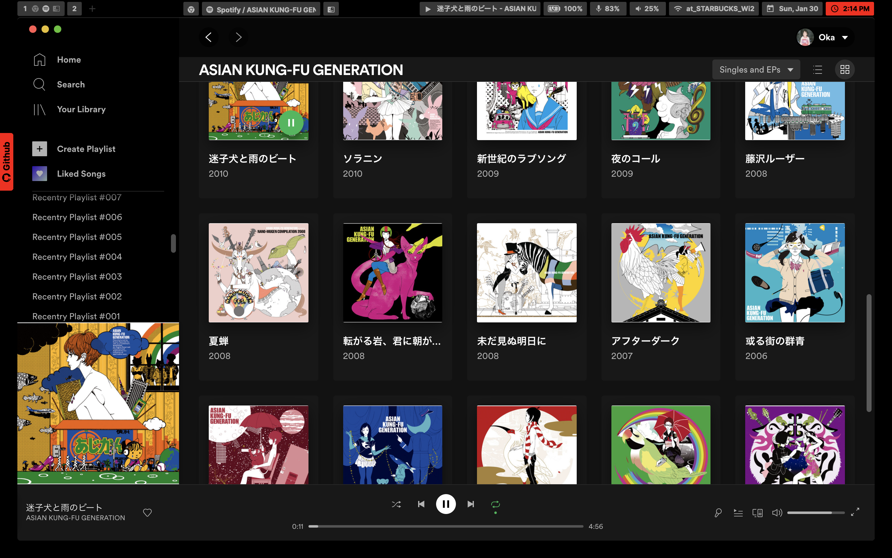
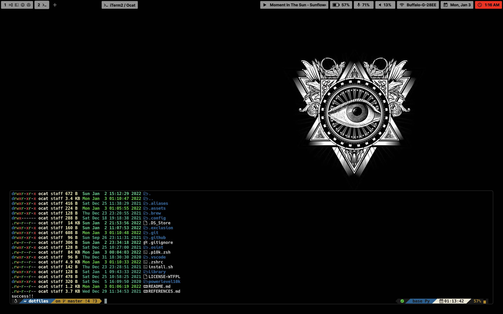
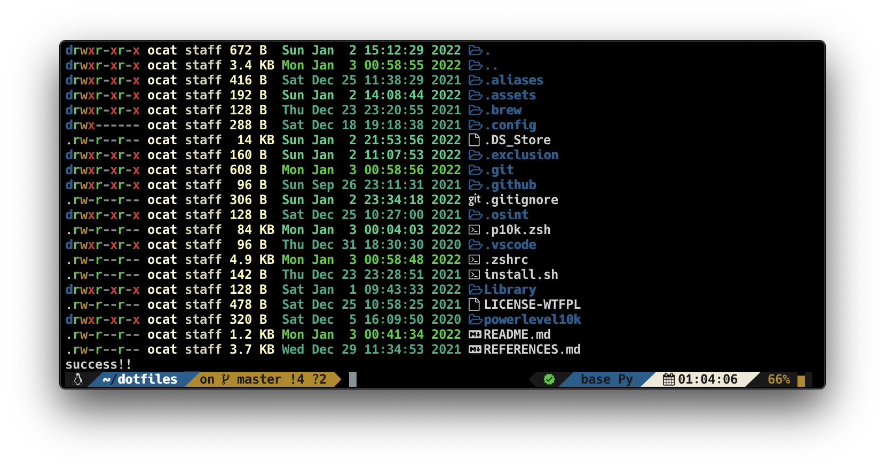

# DOTFILES

<!--  -->



## INSTALL

```
bash -c "$(curl -fsSL https://raw.githubusercontent.com/Coordinate-Cat/dotfiles/master/install.sh)"

```

| System   | Details                | link                                                      |
|:---------|:-----------------------|:---------------------------------------------------------:|
| OS       | macOS                  | /                                                         |
| DE       | Aqua                   | /                                                         |
| WM       | Rectangle(yabai)       | [URL](https://github.com/rxhanson/Rectangle)              |
| Font     | Hack Nerd Font         | [URL](https://github.com/ryanoasis/nerd-fonts)            |
| Shell    | Zsh                    | [URL](https://sourceforge.net/p/zsh/code/ci/master/tree/) |
| Theme    | p10k                   | [URL](https://github.com/romkatv/powerlevel10k)           |
| MenuBar  | Übersicht(simeple-bar) | [URL](http://tracesof.net/uebersicht/)                    |
| Terminal | iTerm2                 | [URL](https://iterm2.com/)                                |


## DEPENDENCIES
|          |                        |                                                           |
|:---------:|:-----------------------:|:---------------------------------------------------------:|
| webp       | bat                  | boxes                                                        |
| catimg       | fzf                   | git                                                         |
| jp2a       | make      | neofetch              |
| node     | wget         | zplug            |
| yabai    | Zsh                    | zsh-syntax-highlighting |
| sentaku    | font-hack-nerd-font                   | font-inter           |
| rectangle  | ubersicht | Xcode                    |
## TODO

- [ ] install navi
- [ ] move to wiki

## CONTRIBUTORS

<a href="https://github.com/Coordinate-Cat/dotfiles/graphs/contributors">
  
</a>

Made with [contributors-img](https://contributors-img.web.app).

## LICENSE

[LICENSE-WTFPL](https://github.com/Coordinate-Cat/dotfiles/blob/master/LICENSE-WTFPL)

## CODE OF CONDUCT

[Contributor Covenant Code of Conduct](https://github.com/Coordinate-Cat/dotfiles/blob/master/CODE_OF_CONDUCT.md)
