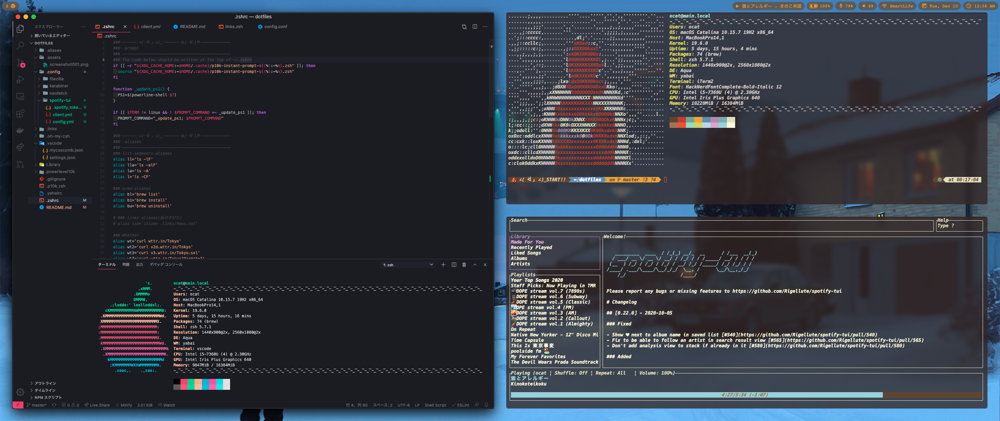
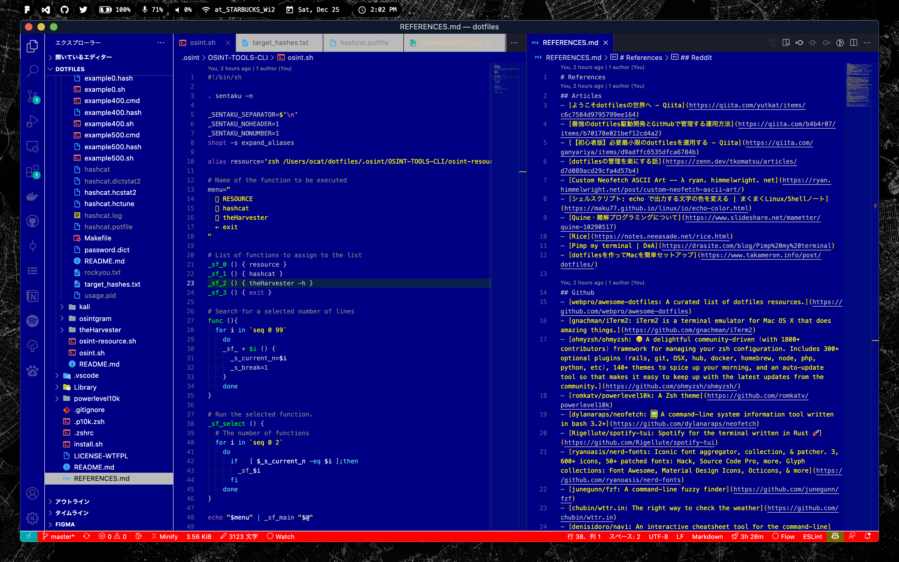

# dotfiles

<!--  -->

<!-- 
 -->

| System   | Details                         |
|:---------|:--------------------------------|
| OS       | macOS Catalina 10.15.7          |
| DE       | Aqua                            |
| WM       | Rectangle(yabai)                |
| Font     | HackNerdFontComplete-Regular 13 |
| Shell    | zsh                             |
| MenuBar  | Übersicht                       |
| Terminal | iTerm2                          |

## Contributors

Made with [contributors-img](https://contributors-img.web.app).

## License

[LICENSE-WTFPL](https://github.com/Coordinate-Cat/dotfiles/blob/master/LICENSE-WTFPL)