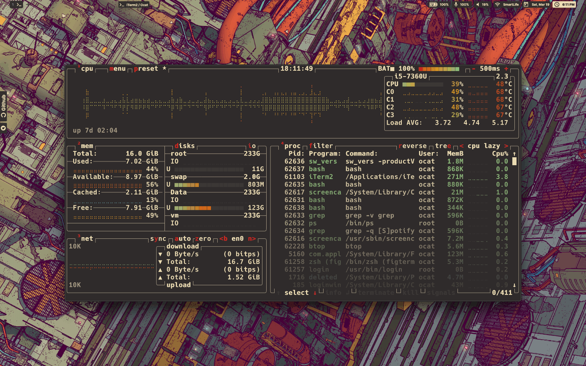
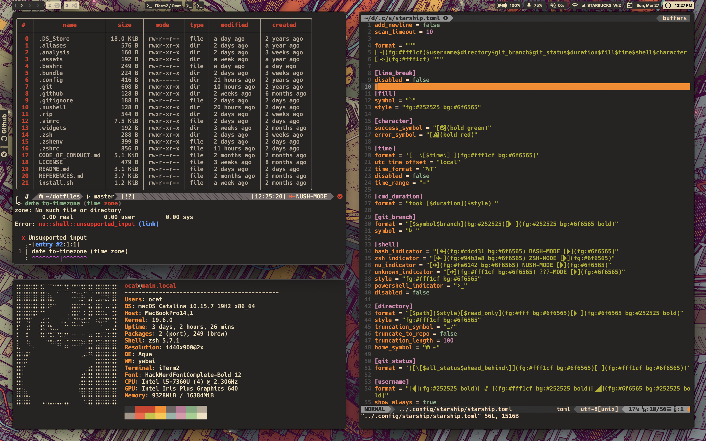
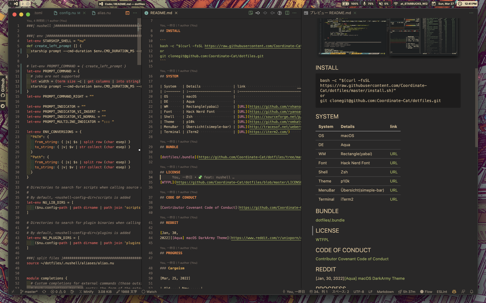
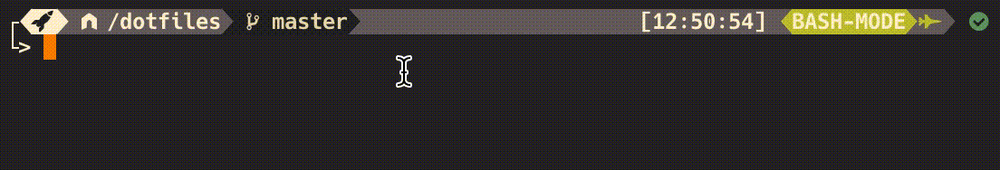
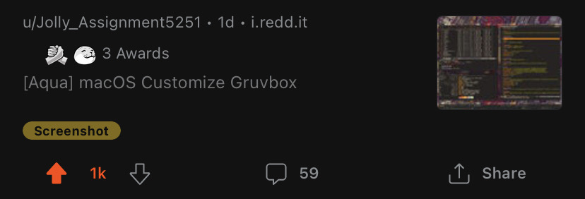

# DOTFILES


## APPEARANCE

|Appearance1|
|:-:|
||

|Appearance2|
|:-:|
||

|Appearance3|
|:-:|
||

#### STARSHIP

|Appearance4|
|:-:|
||

[multiple-shell-mode-system](https://github.com/Coordinate-Cat/multiple-shell-mode-system)

## INSTALL

```
bash -c "$(curl -fsSL https://raw.githubusercontent.com/Coordinate-Cat/dotfiles/master/install.sh)"
```
```
git clone git@github.com:Coordinate-Cat/dotfiles.git
```

## SYSTEM

| System    | Details                                                                       |
| :-------- | :---------------------------------------------------------------------------- |
| OS        | macOS                                                                         |
| DE        | Aqua                                                                          |
| WM        | Rectangle(yabai)                                                              |
| Font      | Hack Nerd Font                                                                |
| Shell     | Bash, Zsh, Fish, Nushell, Elvish, Xonsh                                       |
| Theme     | Gruvbox                                                                       |
| Prompt    | Starship                                                                      |
| MenuBar   | Übersicht(simeple-bar)                                                        |
| Terminal  | iTerm2                                                                        |
| Wallpaper | [URL](https://github.com/FrenzyExists/wallpapers/blob/main/Gruv/platform.jpg) |

## BUNDLE

[dotfiles/.bundle](https://github.com/Coordinate-Cat/dotfiles/tree/master/.bundle)

## LICENSE

[WTFPL](https://github.com/Coordinate-Cat/dotfiles/blob/master/LICENSE)

## CODE OF CONDUCT

[Contributor Covenant Code of Conduct](https://github.com/Coordinate-Cat/dotfiles/blob/master/CODE_OF_CONDUCT.md)

## REDDIT

Trend #1 & Upvote 1k\
[[Aqua] macOS Customize Gruvbox](https://www.reddit.com/r/unixporn/comments/tpg3rs/aqua_macos_customize_gruvbox)


## CONTRIBUTORS

<a href="https://github.com/Coordinate-Cat/dotfiles/graphs/contributors">
  
</a>

Made with [contributors-img](https://contributors-img.web.app).
