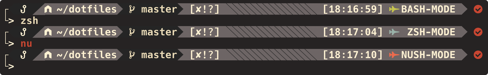

# DOTFILES


## APPEARANCE


### STARSHIP


## INSTALL
```
bash -c "$(curl -fsSL https://raw.githubusercontent.com/Coordinate-Cat/dotfiles/master/install.sh)"
```
```
git clone git@github.com:Coordinate-Cat/dotfiles.git
```

## SYSTEM

| System    | Details                                                                       |
|:----------|:------------------------------------------------------------------------------|
| OS        | macOS                                                                         |
| DE        | Aqua                                                                          |
| WM        | Rectangle(yabai)                                                              |
| Font      | Hack Nerd Font                                                                |
| Shell     | Zsh + Nushell                                                                 |
| Theme     | Gruvbox                                                                       |
| Prompt    | Starship                                                                      |
| MenuBar   | Übersicht(simeple-bar)                                                        |
| Terminal  | iTerm2 or wezterm                                                             |
| Wallpaper | [URL](https://github.com/FrenzyExists/wallpapers/blob/main/Gruv/platform.jpg) |

## BUNDLE

[dotfiles/.bundle](https://github.com/Coordinate-Cat/dotfiles/tree/master/.bundle)

## LICENSE

[WTFPL](https://github.com/Coordinate-Cat/dotfiles/blob/master/LICENSE)

## CODE OF CONDUCT

[Contributor Covenant Code of Conduct](https://github.com/Coordinate-Cat/dotfiles/blob/master/CODE_OF_CONDUCT.md)

## REDDIT

Trend #1 & Upvote 1k\
[[Aqua] macOS Customize Gruvbox](https://www.reddit.com/r/unixporn/comments/tpg3rs/aqua_macos_customize_gruvbox)


## PROGRESS

### Rustism

[Mar, 27, 2022]\
[Mar, 25, 2022]

- nushell
- starship
- exa
- wezterm
- gitui

### Update

[Mar, 27, 2022]\
[Mar, 25, 2022]\
[Mar, 22, 2022]

| TODO                    | DO or NOT | Details                            | Status |
|:------------------------|:---------:|:-----------------------------------|:------:|
| zsh + nushell           |  ~~DO~~   | testing                            |  Done  |
| add .shell              |    DO     | .shell>.bash, .zsh, .nush, .elvish |  Done  |
| .rip                    |    DO     | config file only                   |  High  |
| wezterm                 |    DO     |                                    |  High  |
| Cica or Fira            |    DO     |                                    |  High  |
| ~~Starship~~            |  ~~DO~~   |                                    |  Done  |
| world.sh                |    DO     |                                    | Middle |
| macos defaults cmd      |    DO     |                                    |  High  |
| .analysis graph gh-page |    DO     | Chart.js?                          |  Low   |
| gitui bad credentials   |    DO     |                                    |  Low   |

## CONTRIBUTORS

<a href="https://github.com/Coordinate-Cat/dotfiles/graphs/contributors">
  
</a>

Made with [contributors-img](https://contributors-img.web.app).
