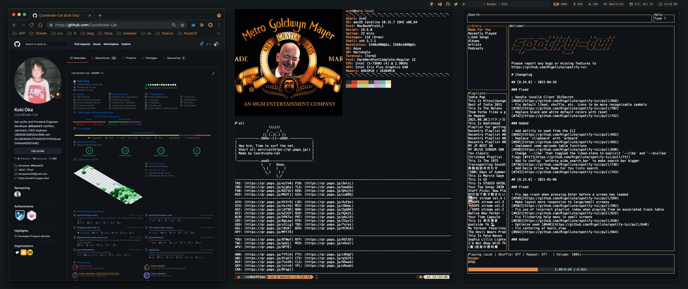

# dotfiles

∠( ᐛ 」∠)_ --- dotfiles --- ᕕ( ᐛ )ᕗ

### Plz Help 🙇‍♂️
| Issue number | Issue title                                                                               | Contributors                       |
|:-------------|:------------------------------------------------------------------------------------------|:-----------------------------------|
| ~~#3~~       | ~~[PS1で＄前のprompt名を変更できない](https://github.com/Coordinate-Cat/dotfiles/issues/3)~~  | [@ulwlu](https://github.com/ulwlu) |
| #8           | [Cannot alias bat command](https://github.com/Coordinate-Cat/dotfiles/issues/8)           |                                    |

### TODO
| TODO number     | TODO title       |
|:----------------|:-----------------|
| ~~#1~~          | ~~bat~~          |
|   #2            |   fzf            |
| ~~#3~~          | ~~spotify-tui~~  |

---

---

| System     | Details                        |
|:-----------|:-------------------------------|
| OS         | macOS Catalina                 |
| DE         | Aqua                           |
| WM         | Rectangle(yabai)               |
| Font       | HackNerdFontComplete-Regular 13|
| Shell      | zsh                            |
| MenuBar    | Übersicht                      |
| Terminal   | iTerm2                         |

---

## 🐋 Contributors

Made with [contributors-img](https://contributors-img.web.app).

## 🚧 Under development...