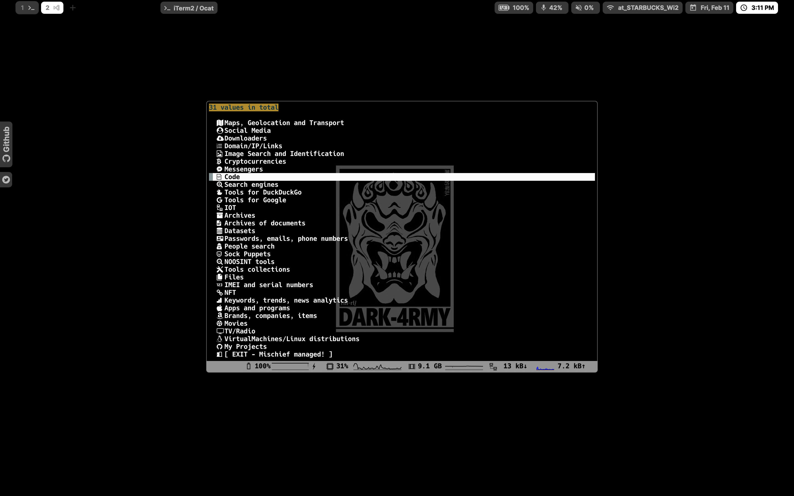
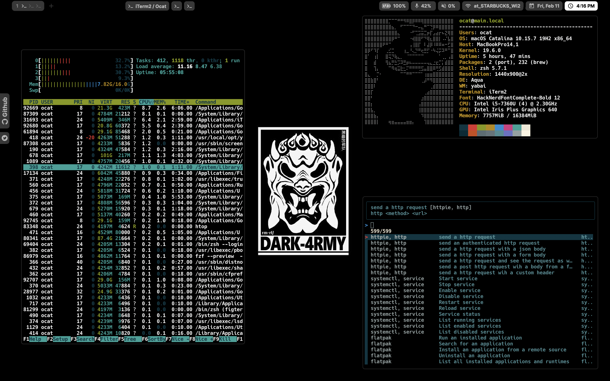

# DOTFILES

<!--  -->

## INSTALL

`bash -c "$(curl -fsSL https://raw.githubusercontent.com/Coordinate-Cat/dotfiles/master/install.sh)"`

## SYSTEM
| System   | Details                |                           link                            |
|:---------|:-----------------------|:---------------------------------------------------------:|
| OS       | macOS                  |                             /                             |
| DE       | Aqua                   |                             /                             |
| WM       | Rectangle(yabai)       |       [URL](https://github.com/rxhanson/Rectangle)        |
| Font     | Hack Nerd Font         |      [URL](https://github.com/ryanoasis/nerd-fonts)       |
| Shell    | Zsh                    | [URL](https://sourceforge.net/p/zsh/code/ci/master/tree/) |
| Theme    | p10k                   |      [URL](https://github.com/romkatv/powerlevel10k)      |
| MenuBar  | Übersicht(simeple-bar) |          [URL](http://tracesof.net/uebersicht/)           |
| Terminal | iTerm2                 |                [URL](https://iterm2.com/)                 |

## DEPENDENCIES
|           |                     |                         |
|:---------:|:-------------------:|:-----------------------:|
|   webp    |         bat         |          boxes          |
|  catimg   |         fzf         |           git           |
|   jp2a    |        make         |        neofetch         |
|   node    |        wget         |          zplug          |
|   yabai   |         Zsh         | zsh-syntax-highlighting |
|  sentaku  | font-hack-nerd-font |       font-inter        |
| rectangle |      ubersicht      |          Xcode          |
|   navi    |      hyperfine      |           fig           |
|    lsd    |         fnm         |                         |

- [Coordinate-Cat/OSINT-TOOLS-CLI](https://github.com/Coordinate-Cat/OSINT-TOOLS-CLI)
- [Coordinate-Cat/fav-links-widget](https://github.com/Coordinate-Cat/fav-links-widget)

<!-- ## TODO
- [ ] install navi
- [ ] move to wiki -->

## LICENSE

[WTFPL](https://github.com/Coordinate-Cat/dotfiles/blob/master/LICENSE-WTFPL)

## CODE OF CONDUCT

[Contributor Covenant Code of Conduct](https://github.com/Coordinate-Cat/dotfiles/blob/master/CODE_OF_CONDUCT.md)

## REDDIT
[Jan, 30, 2022][[Aqua] macOS DarkArmy Theme](https://www.reddit.com/r/unixporn/comments/sg1598/aqua_macos_darkarmy_theme/)
## CONTRIBUTORS

Made with [contributors-img](https://contributors-img.web.app).